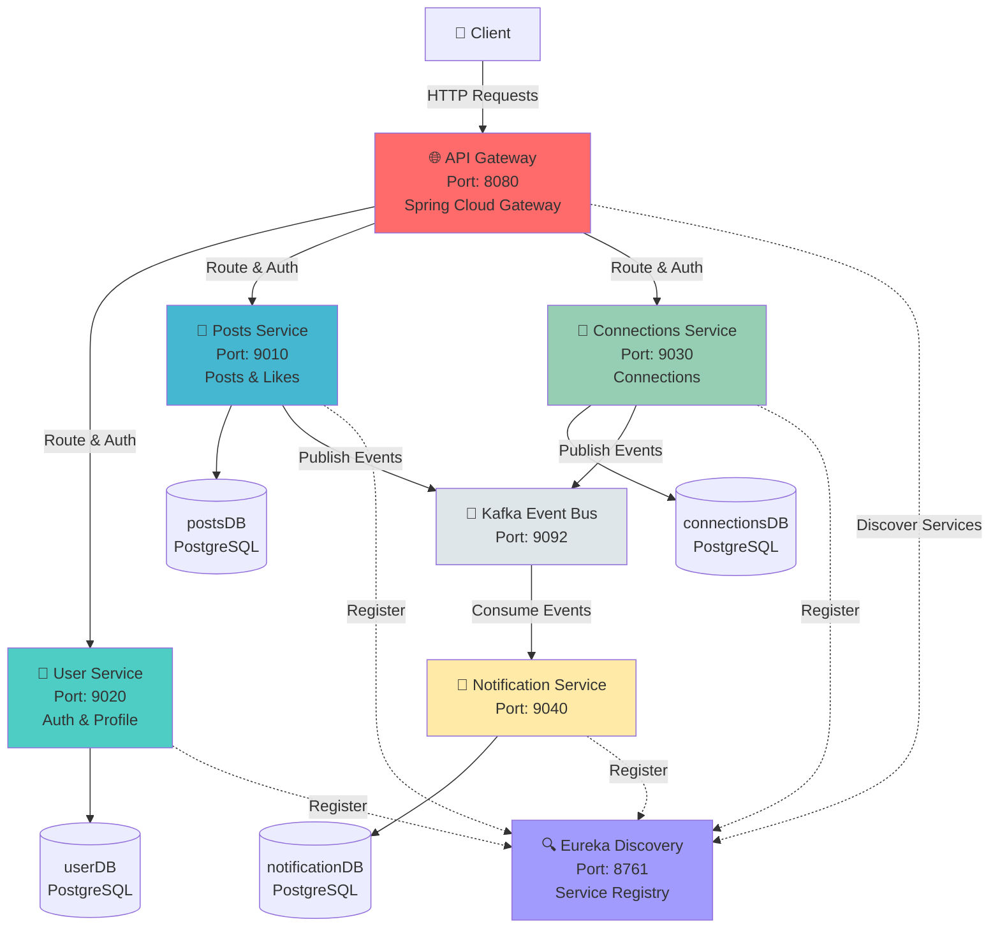
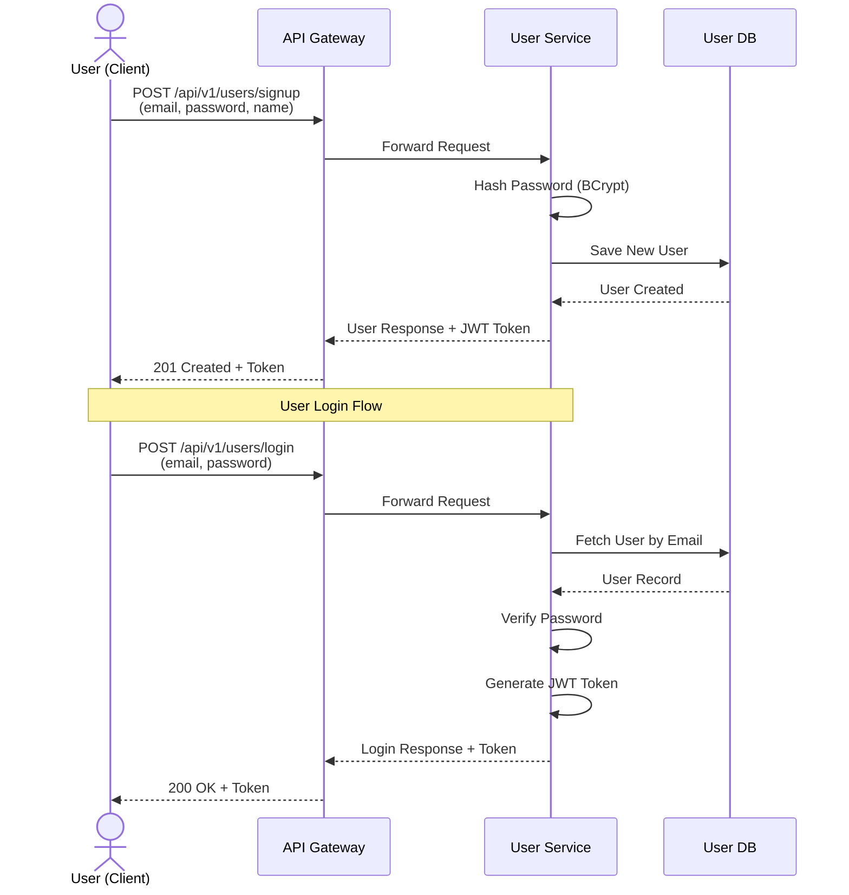
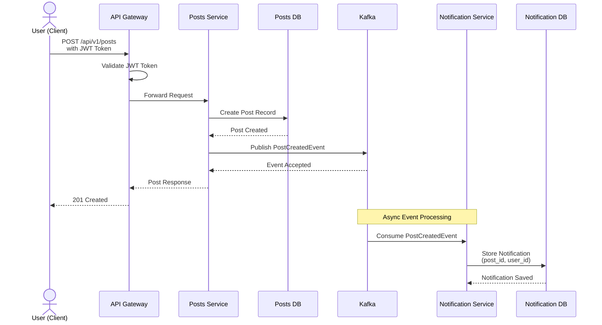
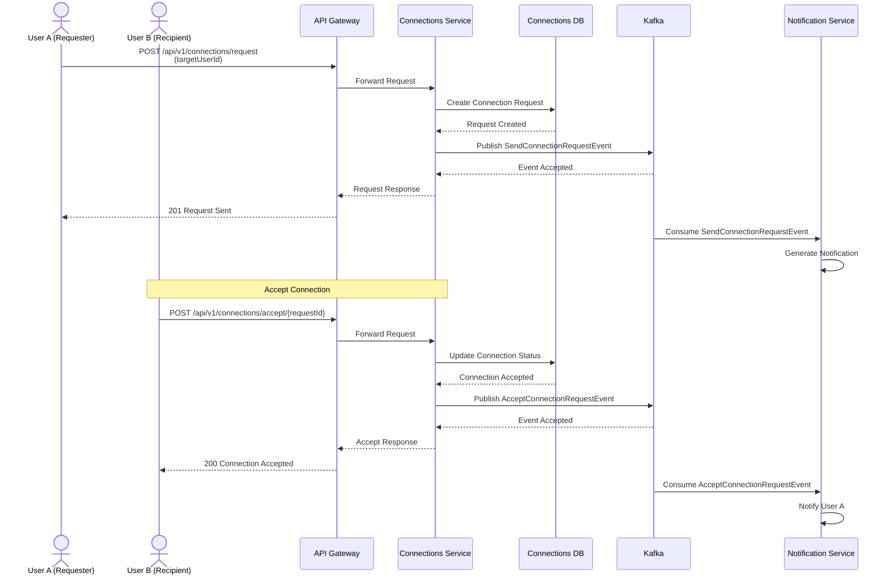
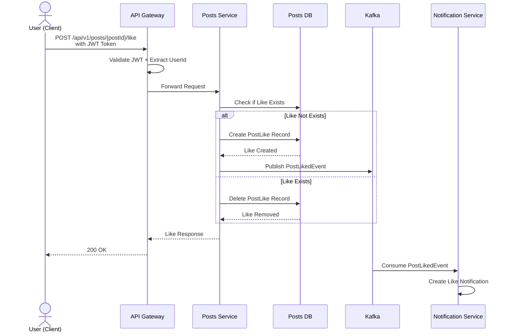
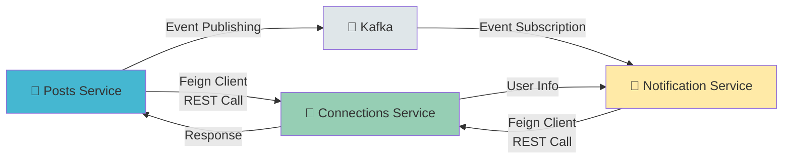
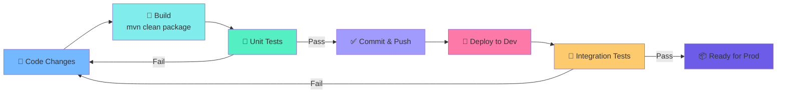

# LinkedIn Microservices

A Spring Boot microservices architecture resembling LinkedIn, featuring service-to-service communication, API gateway, and event-driven messaging.

## 🏗️ Architecture Overview



## 📋 Microservices

### 1. **API Gateway** (Port: 8080)
- Central entry point for all client requests
- Route management and load balancing
- JWT authentication and authorization
- Request filtering and preprocessing

### 2. **User Service** (Port: 9020)
- User registration and authentication
- JWT token generation and validation
- User profile management
- Password hashing with bcrypt

### 3. **Posts Service** (Port: 9010)
- Create, read, update, delete posts
- Like functionality for posts
- Event publishing for post creation and likes
- Database: PostgreSQL

### 4. **Connections Service** (Port: 9030)
- Connection request management
- Accept/reject connection requests
- Track user connections
- Event-driven communication with other services

### 5. **Notification Service** (Port: 9040)
- Consume events from Kafka
- Handle connection requests and post notifications
- Event processing from Posts and Connections services
- Multi-service event aggregation

### 6. **Discovery Server** (Port: 8761)
- Eureka service registry
- Service registration and discovery
- Load balancing support
- Health checks

## 🚀 Getting Started

### Prerequisites
- Java 17+
- Maven 3.8+
- PostgreSQL 12+
- Apache Kafka 3.0+
- Docker (optional)

### Installation & Setup

1. **Clone the repository**
   ```bash
   git clone https://github.com/theadityadongre/linkedIn.git
   cd linkedInApp
   ```

2. **Start PostgreSQL**
   ```bash
   # macOS with Homebrew
   brew services start postgresql
   
   # Or manually
   postgres -D /usr/local/var/postgres
   ```

3. **Start Kafka**
   ```bash
   # Start Zookeeper
   bin/zookeeper-server-start.sh config/zookeeper.properties
   
   # Start Kafka Server
   bin/kafka-server-start.sh config/server.properties
   ```

4. **Create Database**
   ```sql
   CREATE DATABASE postsDB;
   CREATE DATABASE userDB;
   CREATE DATABASE connectionsDB;
   CREATE DATABASE notificationDB;
   ```

5. **Start Services** (in order)
   ```bash
   # Terminal 1: Discovery Server
   cd discovery-server && mvn spring-boot:run
   
   # Terminal 2: User Service
   cd user-service && mvn spring-boot:run
   
   # Terminal 3: Posts Service
   cd posts-service && mvn spring-boot:run
   
   # Terminal 4: Connections Service
   cd connections-service && mvn spring-boot:run
   
   # Terminal 5: Notification Service
   cd notification-service && mvn spring-boot:run
   
   # Terminal 6: API Gateway
   cd api-gateway && mvn spring-boot:run
   ```

## 📡 API Endpoints

### User Service
```
POST   /api/v1/users/signup       - Register new user
POST   /api/v1/users/login        - User login
GET    /api/v1/users/{id}         - Get user profile
```

### Posts Service
```
POST   /api/v1/posts              - Create post
GET    /api/v1/posts              - Get all posts
GET    /api/v1/posts/{id}         - Get post details
DELETE /api/v1/posts/{id}         - Delete post
POST   /api/v1/posts/{id}/like    - Like a post
```

### Connections Service
```
POST   /api/v1/connections/request      - Send connection request
POST   /api/v1/connections/accept/{id}  - Accept connection
GET    /api/v1/connections              - Get user connections
```

## 🔄 Inter-Service Communication

- **Sync**: REST calls via Feign Client
- **Async**: Kafka event streaming for eventual consistency

## 📊 Workflow Diagrams

### 1️⃣ User Registration & Login Flow



### 2️⃣ Create Post & Notification Flow



### 3️⃣ Connection Request & Accept Flow



### 4️⃣ Like Post Flow



### 5️⃣ Service-to-Service Communication Pattern



## 🗄️ Database Architecture

Each microservice has its own database (Database per service pattern):
- **User Service**: userDB (User, Auth data)
- **Posts Service**: postsDB (Posts, Likes)
- **Connections Service**: connectionsDB (Connections, Requests)
- **Notification Service**: notificationDB (Notifications)

## 🔐 Security

- JWT token-based authentication
- Gateway-level request authentication
- Password hashing with BCrypt
- Encrypted inter-service communication

## 📚 Tech Stack

- **Framework**: Spring Boot 3.x
- **Cloud**: Spring Cloud (Eureka, Gateway, OpenFeign)
- **Database**: PostgreSQL
- **Messaging**: Apache Kafka
- **Build**: Maven
- **Authentication**: JWT (JSON Web Tokens)

## 🛠️ Development

### Running Tests
```bash
cd [service-name]
mvn test
```

### Build
```bash
cd [service-name]
mvn clean package
```

### Docker (Optional)
```bash
docker-compose up
```

### Development Workflow



## 📊 Monitoring

- **Service Registry**: http://localhost:8761 (Eureka Dashboard)
- **API Gateway**: http://localhost:8080

## 🤝 Contributing

1. Create a feature branch
2. Make your changes
3. Submit a pull request

## 📝 License

This project is licensed under the MIT License.

## 📧 Contact

For questions or support, contact the development team.

---

**Last Updated**: July 2026
